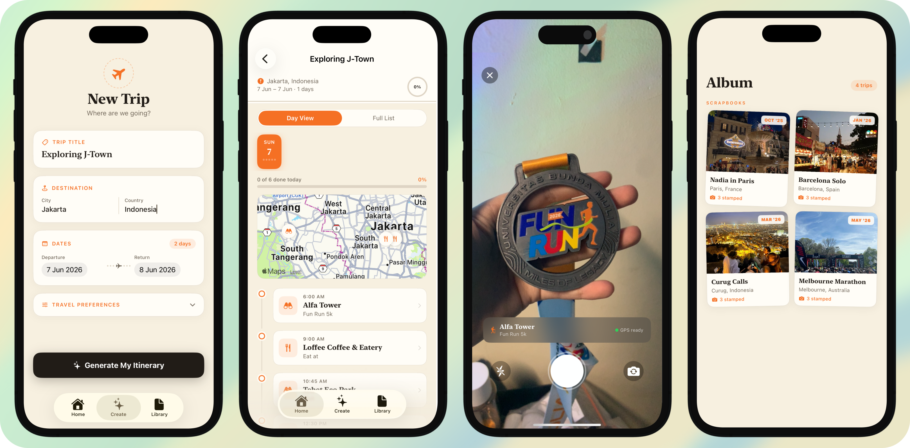

# Little Miss Peregrine

<p align="center">
  
</p>

<p align="center">
<a href="https://github.com/12elia" rel="nofollow"></a>
<a href="https://github.com/12elia/Little-Miss-Peregrine/blob/main/LICENSE"></a>
<a href="http://instagram.com/intent/follow?screen_name=nadiaaureliac" rel="nofollow"></a>
</p>

Hello, Travelers!

This is my first attempt at developing an iOS travel companion app as one of the portfolio submissions for Apple Developer Academy. The app generates personalized itineraries tailored to the user's destination, budget, travel styles, and preferred pace. To encourage authentic exploration, users check in at venues by taking a Live Photo on-site, while a GPS verification system confirms whether each visit was genuine. The result is a passport-like travel experience that combines trip planning, discovery, and travel memories.

Unlike many travel apps, Little Miss Peregrine is privacy-first. All trip data is stored locally using SwiftData, meaning users do not need to create an account or sign in. Their itineraries, progress, and travel history remain on their device.

> insert demo video here

## Core Features:
- 💁‍♀️ **Personalized Itineraries**: User enters their destination, date, and preferences (budget, pace, styles) if needed, and app searches Apple Maps for real venues using MKLocalSearch, clusters them geographically so each day stays in one neighbourhood, and slots them into time blocks based on user’s preferred pace.
- 📸 **Live Photo verification**: To mark a spot as completed, users must take a Live Photo using the in-app camera, the app then compares user’s current GPS coordinates to the venue’s location and classifies check-in as:
   - Approved (within 200m from venue),
   - Warning (between 200-500m from venue),
   - Rejected (more than 500m away from venue)

```To preserve the integrity of the travel log, the app limits to in-app camera use only as photo library uploads are intentionally disabled.```
- 📖 **Scrapbook Library**: Completed trips are archived into album-like collection complete proof photos, venues name, dates, and completion stats.

## Additional Features:
- Manual Itinerary Management: Users can add their own itinerary items as needed by entering the activity, venue (app-verified), date, and categories.
- Day View vs. List View: a scrollable day strip with a mini MapKit map showing that day's venue pins, and a full-trip list view for editing (add/delete stops with MapKit venue search)
- Users have the choice to override rejected check-ins but app will then log it separately  so the scrapbook can distinguish genuinely verified stops from ones the user pushed through
- Progress trackers that update live as stops and itineraries are being marked off

## Development:
### Project Structures:
```
LittleMissPeregrine/
├── LittleMissPeregrine/
│   ├── App/
│   │   ├── Little_Miss_PeregrineApp.swift    # App entry point & ModelContainer
│   │   ├── ContentView.swift                 # TabView root & navigation state
│   │   └── Constants.swift                   # Tab labels, icon names, strings
│   ├── TripDetails.swift                     # TripDetails, ItineraryItem (SwiftData)
│   ├── Views/
│   │   ├── HomeView.swift                    # Upcoming trips, empty state
│   │   ├── NewTripView.swift                 # Trip creation form
│   │   ├── TripDetailView.swift              # Day view, list view, mini map, swipe
│   │   ├── ProofCameraView.swift             # Live camera + GPS verification
│   │   └── LibraryView.swift                 # Completed trips scrapbook grid
│   │   └── ScrapbookDetailView.swift         # Completed trips album view
│   ├── ItineraryGenerator.swift              # MKLocalSearch + clustering + scheduling
│   ├── EXIFDebugView.swift                   # EXIF extraction + GPS verification debug
│   ├── Resources/
│   │   ├── Assets.xcassets/                  # App icon, colours, dummy photos
│   │   ├── LaunchScreen.storyboard           # Launch screen
│   │   └── Info.plist                        # Permissions, bundle config
│   └── Preview Content/
│       └── Preview Assets.xcassets           # Preview-only assets
└── LittleMissPeregrine.xcodeproj/            # Xcode project file
```

### Key Components
